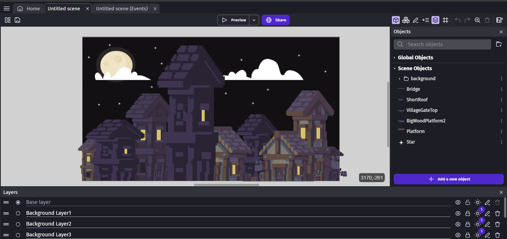

# Entry 1
## Picking a tool 11/12/23

Before I could start anything, I needed to figure out what I wanted to make **(EDP: Brainstorm)** and figure out if it was something that was possible with the tools I was given. Thankfully, while I was scrolling through YouTube I stumbled across videos that talked about [old flash games](https://www.youtube.com/watch?v=ZMa_oXFfXpc&ab_channel=ConnorDawg), and one, in particular, was the [Fancy Pants franchise](https://www.youtube.com/watch?v=MDGxP27uKTE&ab_channel=Maximum). The feeling of nostalgia and just the simpleness of old flash games concluded with me deciding on making a 2D platformer, but with my twist, which was just a medieval-themed 2D platformer. After figuring out the game I wanted to make, my partner Chanry suggested I use [GDevelop](https://editor.gdevelop.io/) instead of Unity, which I had initially thought of **(EDP: Define)**. After deciding on my game and tool, I started doing the tutorials GDevelop has on public display. **(EDP: Research)** After playing with the the tutorials and finishing them, I learned some basics of GDevelop like behaviors and the asset library. All this tinkering allowed me to increase my reading **(How to read)** and learning **(How to learn)** as I would read the documentation and the instructions given during tutorials to grow my understanding of GDevelop and the basics it. With the basics I would use the asset library to start creating the foundation of my project.

[Next](entry02.md)

[Home](../README.md)