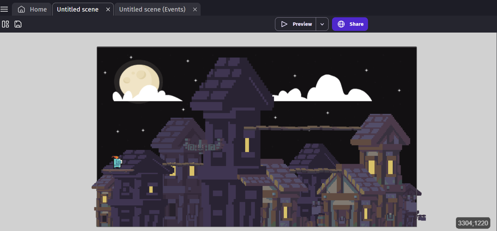
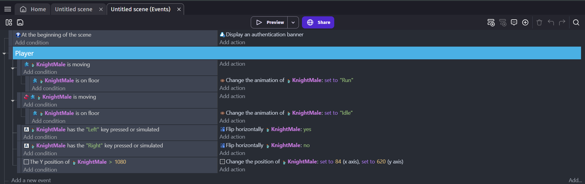

# Entry 2
Learning my Tool 12/17/23

As I picked my tool, I began the creation of my Freedom Project; diving in there without much of a plan. For starters, I decided that it would be best to create the layout for my platformer so I could get a general grasp of what I wanted to input and just what exactly I  would need to work on to make this project better. So after getting some free assets from the [GDevelop Library](https://editor.gdevelop.io/) (Shop) I would try creating a decent-looking background **(EDP: Create)**.

With this, I would lay down a decent foundation I could use to go off of, and thankfully from there I also managed to get a free player model from the library and was able to watch tutorials listed in my learning log that I could use to allow the in real life (IRL) player to control it. For now, I just gave him some basic conditions that allow the correct animation to play when the model is doing certain movements such as jumping and moving around. Most importantly I just made it so that if the irl player ever does fall off the platforms, they could just be sent back to the start.

Overall throughout this whole beginning process, I've improved my pacing **(Problem decomposition) + (Organization)** as instead of trying to figure out how to implement everything I wanted to, I would instead start slowing and just taking it one part at a time by on the moment planning what steps I wanted to do after seeing my completed background so that I don't stress myself out about all the work I would've needed to put into it.
I would say that my FP goal for over the winter break is to just not procrastinate on my FP and fall behind due to it. However, something else that I'll probably want to work on is a second level that is all a boss fight; so I'll probably need to just continue watching some tutorials and just periodically work towards it even if it's only a few minutes per day over the winter break.

[Previous](entry01.md) | [Next](entry03.md)

[Home](../README.md)