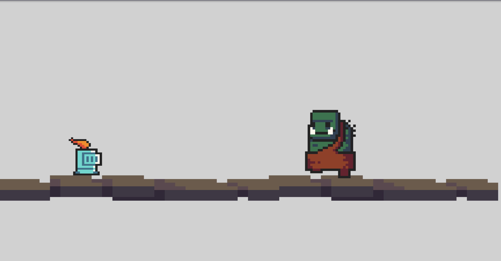
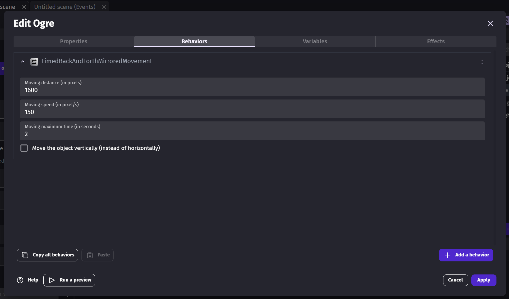
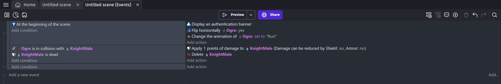

# Entry 3
Developing Enemies 02/11/24

After I had created the main first level of my game, I shifted my attention to the enemy AI's **(EDP: Create & Test)** I was going to use as a challenge for the player. For the creation of such an enemy, I took a good amount of time just trying to grasp the different behaviors and events I could use to implement enemies into my game by indulging myself in videos that taught basic enemy AI creation such as [this](https://www.youtube.com/watch?v=0aGBYsrGwm0) as well as a [game example](https://editor.gdevelop.io/?project=https://resources.gdevelop-app.com/examples/basic-ai-with-pathfinding/basic-ai-with-pathfinding.json) that shows intriguing ai pathfinding that depends on sight, an interesting idea but something I was probably not going to use. For testing, I made a new project that allowed me to first test out the boss before I moved it into my actual game.

At first, I would simply make an enemy that was able to do basic movement such as moving back and forth, and thankfully due to GDevelop having many quality-of-life tools in their game creation, I was able to easily add a basic back and fourth movement with a simple click of a button.

Looking back on it now, I think it is most definitely possible for me to refine the aspects of the movement instead of guessing the set length, I would give it the full length of the screen and subtract it by however much I need it to be. Furthermore, for better movement, I would probably give it an event in which when the enemy sees the player character, the enemy would speed up towards the player, so increasing the speed instead of having the speed stay the same throughout encounters. Another slight issue I would run into while working more with events and behaviors was that I wasn't aware that the different blocks work like their own individual if statements.

As seen in the image above, both the collision detection and the death of the player character are on the same block. This in this instance makes it so the player never dies as each block works as its own if statement, which causes the event to only happen if both conditions in the block activate instead of them working as separate conditions. Thankfully I managed to figure that out and separate such conditions. Truth be told, the lack of progress in my freedom project is due to my incompetence and it is shown through how little progress was made. However, thanks to this I've realized that I have to really improve my time management and also increase my tinkering time as that allows me to gain more experience with GDevelop **(Problem decomposition) + (Time Management)**.

[Previous](entry02.md) | [Next](entry04.md)

[Home](../README.md)
