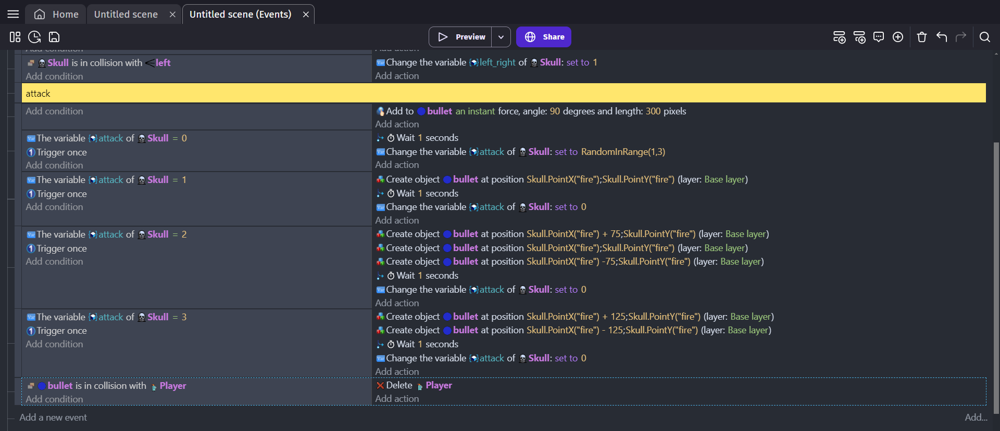

# Entry 4
Developing Boss 03/15/24

After much consideration, I concluded that my game should solely be focused on a boss fight as it would be more engaging while also having the elements of platforming that I wanted to include at the start of this project **(EDP: Create & Test)**. To work towards such goals, I began learning how to develop a simple boss through many tutorials. Such tutorials included the official one by [GDevelop](https://youtu.be/eU0kkLSdw0Y?si=0byaKjtxxXFOkVGr) and one by [JustAGameDeveloper](https://youtu.be/Ld-c0ufLoKk?si=DzWTf5dK635BmdNR) that provided great help in me understanding what it took to create a boss enemy.
Throughout the process of the boss, I've improved upon a few of my skills such as **Embracing Failure** as I've embraced the fact that sometimes things need to change and I went ahead with the idea of revamping my whole idea for the game. Furthermore, I've learned **How to read** as I've continued to gain more knowledge through the use of documentation (aka the videos) throughout the process of creating my game.

As seen through this image, I've managed to create attacks from the boss that allows me to damage player and also see that I have changed the layout of the map quite drastically to be more compatible with the central focus of the game being a boss fighting game with elements of platforming that I'll add soon as a part of my beyond MVP.

[Previous](entry03.md) | [Next](entry05.md)

[Home](../README.md)